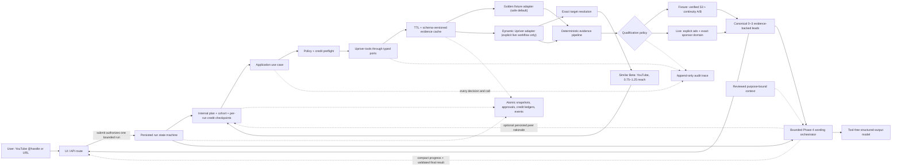

# System architecture

## One input-to-output flow

The deterministic pipeline—not the LLM—owns dates, joins, sponsorship class,
credit arithmetic, eligibility, result count, state transitions, cache keys,
expiry, idempotency, and per-run credit reservation.

### Current public presentation boundary

The rendered page asks for one **Channel handle or URL**. While that field is
editable, the UI reuses the domain parser to show the canonical interpretation
that will be submitted. Selecting **Research channel** starts the bounded run;
the user then sees concise capability-based progress and the final result or
an actionable failure. The result does not render internal credit metrics or
the append-only activity log.

This presentation boundary is ahead of the transport boundary. The browser
still posts hidden internal progression actions, and `/api/runs` still returns
the internal run resource. Moving progression to a durable server worker and
introducing a capability-named public DTO are explicit remaining migrations;
neither is claimed complete here.

## What each component is

| Component | Kind | Responsibility | May call the LLM? | May call Upriver? |
|---|---|---|---:|---:|
| `app/` | Interface | Submit/restore one bounded run, show compact progress, and present the final report | No | No |
| Run workflow | Deterministic coordinator | Legal transitions, submission authorization, internal approvals, idempotency, per-run credits, resume/cancel, generation checkpoints | Through the bounded agent | Only through a tool port |
| Application use case | Deterministic coordinator | Runs the internally authorized workflow through ports | No | Only through a tool port |
| Domain core | Pure code | Normalize, classify, join, gate, rank | No | No |
| Upriver adapter | Tool implementation | Exact public YouTube resolution, bounded Similar Beta discovery, typed sponsor HTTP, timeout, zero-retry paid calls, cost metadata | No | Yes, through explicitly enabled live gates |
| Fixture adapter | Tool implementation | Replays the frozen `@UrAvgConsumer` / Dell-XPS strict oracle with zero credits | No | No |
| Evidence cache | Tool decorator | Mode-isolated read-through cache with TTL/schema/policy invalidation | No | No |
| Workflow repository | Persistence adapter | Atomic snapshots, approvals, credit ledgers, cache, append-only events | No | No |
| Orchestrator | Controlled presentation component | Explain locked peers and word already-qualified claims without strengthening their qualification policy | Yes | No |
| `SKILL.md` | Passive skill context | Describes available Upriver capabilities and constraints | N/A | Never |
| `llms.txt` | Passive docs index | Points to the relevant upstream reference page | N/A | Never |
| LLM adapter | Model boundary | Peer rationale and grounded report wording only | Yes | Never directly |
| Audit sink | Observability | Records tools, skills, LLMs, policy, latency, rows, credits | No | No |

### Skill versus tool

A **skill** is read-only context. Loading it does not execute anything and does
not grant permission. A **tool** is executable code behind a typed port. Every
tool declares why it is needed, its expected credit cost, cache policy,
timeout/retry policy, and the audit fields it emits.

The compatibility `/api/report` route always constructs the fixture adapter.
Paid execution exists only behind `/api/runs`, a server-selected mode, the
user's initial bounded-run authorization, persisted internal plan/cohort/credit
checkpoints, an exact quote, and idempotent per-run operation claims.
`UPRIVER_MODE=live` alone is insufficient; the server must also set
`UPRIVER_LIVE_WORKFLOW=true`. The live contract smoke remains separate with a
six-credit budget and zero automatic retries. The full live adapter rejects
retry-enabled clients because a network timeout can leave billing ambiguous.

### Dynamic live path

The live input boundary accepts an exact, public YouTube `@handle` or channel
URL. It canonicalizes the identity, resolves exactly one creator through
Upriver, and rejects a mismatched response. It never falls back to fuzzy name
search or to the golden fixture.

Peer discovery makes one bounded request to Upriver Similar Creators (Beta)
with:

- `platforms: ["youtube"]`;
- a follower window of 0.75–1.25 times the resolved target;
- a ten-result provider cap.

Content-language matching is deliberately omitted because a controlled live
request for a valid anchor returned `anchor_language_not_ready`. Exact anchor,
platform, and reach checks remain enforced.

The adapter validates the beta wire shape and anchor, removes the target,
duplicates, invalid YouTube URLs, and out-of-range results, then keeps up to
three peers. The workflow freezes that exact cohort hash and stage quote at
internal persisted checkpoints before execution. The initial channel submit
already authorized the bounded policy, so these controls do not become
separate user review screens. Sponsor research then uses a rolling 365-day
target window and a rolling 90-day peer window.

The live qualification policy joins older target and recent peer
`explicit_ad` evidence by exact normalized sponsor domain. The resulting
`same_brand_reactivation` lead explicitly leaves product line, campaign,
business unit, buyer, budget, and agency unverified. The stricter S3 +
product-continuity A/B policy and its manual ledger exist only in the frozen
`@UrAvgConsumer` / Dell-XPS fixture and evals.

### Persistence and resume

The local repository uses private, atomic JSON files under
`.data/sponsor-radar` by default. Snapshot writes use optimistic revisions;
events are immutable and contiguous; approvals, cache keys, and idempotency
keys are stored only as hashes. A filesystem lock serializes credit-ledger
operations across Node processes sharing the same storage directory.

The user's initial submit is the sole UI authorization for one run within the
server-owned policy and ceiling. The existing plan, cohort, and credit approval
records remain internal state-machine checkpoints. They preserve fingerprints,
attribution, and restart safety; they do not ask the user to confirm
non-editable values. If any checkpoint would exceed or diverge from the
authorized bounds, the run stops safely.

Non-cancellable `resolving` and `executing` claims are persisted before their
first tool calls. Refreshing a page reads the saved run instead of creating a
replacement. Active leases keep another tab from racing in-flight work, and
the browser polls those checkpoints. Safe pre-call and post-call checkpoints
can resume deterministically. An interrupted live paid claim is failed closed,
never replayed, and settles its full reservation conservatively.

Credit estimates derived from cache state are checked again immediately before
each internal credit checkpoint. The exact checkpointed stage ceiling is then
injected into the live gateway's internal credit budget, so cache expiry
between inspection and execution cannot authorize extra spend.

Each schema-v4 run persists `per_run_v1` accounting with a hard maximum of 160
credits. Its resolution and execution reservations share that run-specific
ledger, so their settled and active usage is checked atomically without
creating a lifetime shutdown. The former 200-credit shared ledger is closed to
new reservations and retained as historical evidence; a pre-existing active
legacy claim may only settle or release without replay. The current
conservative uncached quote is 157:
two creator results (initial resolution plus forced-fresh execution
revalidation), up to ten Similar Beta results provisionally priced at one
creator-result credit each, 23 grouped target sponsor results at five credits
each, and two grouped sponsor results for each of three peers at five credits
each. Upriver does not document Similar Beta billing, so requested ceilings
and result-based settlements are estimates, not provider-confirmed charges.

Phase 4 writes a durable purpose/input-fingerprint claim before either model
call. If a process restarts with an ambiguous claimed call, it does not replay
the request; the workflow persists deterministic fallback wording. Successful
output and its audit trace are checkpointed atomically with the peer proposal
or report presentation artifact.

### Where LLM calls happen

There are no LLM calls in Phases 0–3. In Phase 4 the orchestrator may make two
bounded calls:

1. explain every member of the exact, deterministic, checkpoint-bound
   reach-matched cohort;
2. draft sentence-level wording from an already-qualified claim/evidence
   ledger.

The provider port returns `unknown`. A trusted wrapper enforces strict schemas,
exact opaque IDs/order/cardinality, exact evidence attribution, input/token/
call/time limits, and no tool calls before returning an application artifact.
The workflow locks peers at an internal checkpoint before expensive research.
The model never selects peers, sees an API key, calls Upriver, changes a query,
or returns a canonical report. For a live dynamic lead, the request ledger and
validator prohibit wording that implies product, campaign, buyer, budget,
agency, or business-unit continuity. Any invalid or unavailable generation
falls back to deterministic wording.

The default model adapter is a network-free fixture. The optional OpenAI
adapter is server-only, zero-retry, tool-free, strict-JSON-Schema, non-stored,
and separately enabled from live Upriver evidence.

## Stable code boundaries

Engineering phases are tracked in `docs/ROADMAP.md`, not encoded as
`phase-1/phase-2` source folders. This keeps the domain and port boundaries
stable as fixture implementations are replaced by live ones.

External JSON is validated at the adapter boundary and normalized into smaller
application types. Raw optional fields do not leak into the domain core.

## Audit event contract

Each run receives a `run_id`. Append-only events can include:

- phase, actor, event type, sequence, and timestamp;
- tool name, mode, reason, input fingerprint, cache status, rows, retries,
  result, request ID, and duration;
- skill name, upstream version/hash, section loaded, and reason;
- LLM provider/model, purpose, prompt/context/evidence/output fingerprints,
  token limits/usage, provider request ID, attempt count, latency,
  structured-validation result, outcome, and safe error type;
- policy decision, initial user-authorization identity/time, internal
  checkpoint identity/time, preflight credits, result-based credit estimate,
  and reconciliation status;
- time to first result and total run duration.

API keys, raw authorization headers, personal usage-account fields, and full
prompts containing sensitive data are never logged.

The legacy API route emits each safe audit event to the server log as it occurs.
Run resources also persist transition history and safe tool/HTTP/LLM audit
events, then return them with the saved report.
