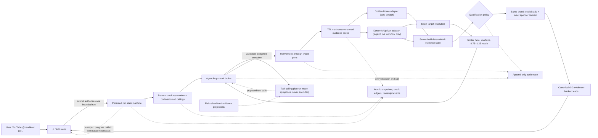

# System architecture

## One input-to-output flow

Deterministic code — not the LLM — owns dates, joins, sponsorship class,
credit arithmetic, eligibility, result count, state transitions, cache keys,
expiry, idempotency, and per-run credit reservation. The planner chooses only
the order and depth of the research.

### Current public presentation boundary

The page asks for one **Channel handle or URL**. While that field is editable,
the UI reuses the domain parser to show the canonical interpretation before
submission. Selecting **Research channel** starts the bounded run; the user then
sees concise progress and the final result or an actionable failure. The result
renders no internal credit metrics or activity log.

The presentation boundary is ahead of the transport boundary: the run executes
server-side inside the create request and the browser only polls the saved
record — no internal progression actions are posted — but `/api/runs` still
returns the internal run resource. Moving execution to a durable background
worker and adding a capability-named public DTO are explicit remaining
migrations.

## What each component is

| Component | Kind | Responsibility | May call the LLM? | May call Upriver? |
|---|---|---|---:|---:|
| `app/` | Interface | Submit/restore one bounded run, show compact progress, present the report | No | No |
| Run engine | Deterministic coordinator | Legal transitions, submission authorization, idempotency, per-run credits, persisted heartbeats, fail-closed recovery | Through the agent loop | Only through a tool port |
| Application use case | Deterministic coordinator | Composes one autonomous, internally authorized run through ports | No | Only through a tool port |
| Tool registry + executor | Authoritative operation policy (ADR 0004) | Declares the five canonical provider operations (identity, endpoint, modes, stages, pricing reference, settlement class, audit name); one executor validates registration, mode, stage, input, cache, output, and settlement around every adapter call | No | Only through a tool port |
| Domain core | Pure code | Normalize, classify, join, gate, rank | No | No |
| Upriver adapter | Tool implementation | Exact public YouTube resolution, bounded Similar Beta discovery, typed sponsor HTTP, timeout, zero-retry paid calls, cost metadata | No | Yes, through explicitly enabled live gates |
| Fixture adapter | Tool implementation | Replays the frozen `@UrAvgConsumer` / Dell golden cohort with zero credits | No | No |
| Evidence cache | Tool decorator | Mode-isolated read-through cache with TTL/schema/policy invalidation | No | No |
| Workflow repository | Persistence adapter | Atomic snapshots, approvals, credit ledgers, cache, append-only events | No | No |
| Agent loop + tool broker | Mediating coordinator | Feed allowlisted projections to the planner, validate every proposal against the six-tool catalog, preflight and settle credits, execute through the single `ToolExecutor` | Yes | Only through a tool port |
| `SKILL.md` | Passive skill context | Describes available Upriver capabilities and constraints | N/A | Never |
| `llms.txt` | Passive docs index | Points to the relevant upstream reference page | N/A | Never |
| LLM adapter | Model boundary | Tool-call proposals for the research loop only; authors no fact-bearing field | Yes | Never directly |
| Audit sink | Observability | Records tools, skills, LLMs, policy, latency, rows, credits | No | No |

### Skill versus tool

A **skill** is read-only context: loading it executes nothing and grants no
permission. A **tool** is executable code behind a typed port, and declares why
it's needed, its expected credit cost, cache policy, timeout/retry policy, and
the audit fields it emits.

The single source for that declaration is the authoritative registry at
`src/radar/application/tools/tool-registry.ts` (ADR 0004): the `EvidenceOperation`
vocabulary comes from its keys, each price is its rate-kind × result-cap into the
one rate card, the frozen `${mode}.${operation}` audit names are derived by its
helper for writers and readers, and `EvidenceToolExecutor` is the only path from
application code to an evidence adapter. Deferred capabilities (brand research)
are unregistered and fail closed; guardrail tests pin that audit history never
leaves the registry vocabulary and that `llmExposed` stays false — the agent
tool catalog is a separate proposal surface, and every proposal is executed by
the broker through this one executor, never by the model.

Paid execution exists only behind `/api/runs`, a server-selected mode, the
user's initial bounded-run authorization, a persisted up-front per-run credit
reservation, conservative per-call preflight, and idempotent per-run operation
claims. `UPRIVER_MODE=live` alone
is insufficient — the server must also set `UPRIVER_LIVE_WORKFLOW=true`. The live
contract smoke stays separate with a six-credit budget and zero retries. The full
live adapter rejects retry-enabled clients because a timeout can leave billing
ambiguous.

### Dynamic live path

The live input boundary accepts an exact, public YouTube `@handle` or channel
URL, canonicalizes the identity, resolves exactly one creator through Upriver,
and rejects a mismatched response. It never falls back to fuzzy name search or
the golden fixture.

Peer discovery makes one bounded request to Upriver Similar Creators (Beta):

- `platforms: ["youtube"]`;
- a follower window of 0.75–1.25× the resolved target;
- a ten-result provider cap.

Content-language matching is deliberately omitted because a controlled live
request for a valid anchor returned `anchor_language_not_ready`; exact anchor,
platform, and reach checks stay enforced.

The adapter validates the beta wire shape and anchor, removes the target,
duplicates, invalid YouTube URLs, and out-of-range results, then keeps up to
three peers. The broker locks that cohort in server-held evidence state before
any peer sponsor research — the initial submit already authorized the bounded
policy, and there are no separate user review screens. Sponsor research then
uses a rolling 365-day target window and a rolling 90-day peer window.

`same_brand_reactivation` — the one qualification policy in both modes — joins
older target and recent peer `explicit_ad` evidence by exact normalized sponsor
domain. To spend only on work that can produce a lead, the tool catalog prices
the expensive target-history call and directs the planner to research peer
sponsor histories first; a run that finishes without searching target history
reports honestly that target history wasn't searched (never that the target
has no sponsors). The resulting
lead explicitly leaves product line, campaign, business unit, buyer, budget, and
agency unverified. The stricter S3 + product-continuity eligibility rubric
survives only as domain-core vocabulary pinned by the frozen strict-gate eval
corpus; no report path applies it anymore.

### Persistence and resume

Run records persist as `agentic-v1` documents in private, atomic JSON files
under `${SPONSOR_RADAR_DATA_DIR}/agentic`; the evidence cache stays at the
data-dir root so pre-cutover cached evidence keeps serving runs. Snapshot
writes use optimistic revisions; events are immutable and contiguous; cache
keys and idempotency keys are stored only as hashes. A filesystem lock
serializes credit-ledger operations across Node processes sharing the storage
directory.

The initial submit is the sole UI authorization for one run within the
server-owned policy and ceiling. The run record and its full per-run credit
reservation are persisted before the loop's first tool call, and every ceiling
— iterations, planner calls, output tokens, transcript bytes, credits — is
enforced in code. A tool proposal that would exceed the remaining budget is
denied with a structured envelope instead of spending; a breached ceiling
terminates the run fail-closed.

Refreshing a page reads the saved run instead of creating a new one. The loop
persists per-iteration budget heartbeats and transcript events, an active lease
keeps another tab from racing in-flight work, and the browser polls the saved
record. Recovery is fail-closed: an interrupted run offers only `resume` once
its lease expires, which settles the reservation conservatively at the full
ceiling and terminates the run as failed — ambiguous paid work is never
replayed.

Credit preflight runs immediately before each tool call against the remaining
per-run reservation, and that ceiling is injected into the live gateway's
budget, so cache expiry between inspection and execution can't authorize extra
spend.

Each agentic run persists `per_run_v1` accounting with a hard maximum of 160
credits, reserved atomically up front on a run-specific ledger without a
lifetime shutdown. The former 200-credit shared ledger is closed to new
reservations and retained as historical evidence. Conservative per-call
preflight estimates are one credit per creator resolution, up to ten Similar
Beta results at one creator-result credit each, 23 grouped target sponsor
results at five credits each, and two grouped sponsor results for each of
three peers at five credits each; actual spend varies with the planner's
chosen path. Upriver doesn't document Similar Beta billing, so ceilings and
result-based settlements are estimates, not provider-confirmed charges.

Every consequential step is durable before it can matter: the snapshot and
reservation precede the first tool call, paid calls settle conservatively on
failure with no automatic replay, and the terminal record — report or typed
failure — is checkpointed atomically with its audit trace.

### Where LLM calls happen

The planner model is called once per loop iteration — at most 12 per run — to
choose the next tool call or finish. The provider port returns `unknown`; a
trusted wrapper enforces strict schemas, the fixed tool catalog, per-call and
per-run token ceilings, transcript byte ceilings, and zero retries. The model
sees only field-allowlisted, truncated evidence projections — no excerpts, raw
provider payloads, content URLs, or API keys — and its tool arguments are
reference-based, resolved against server-held state, so its output can never
steer a paid call to an arbitrary target. Code computes qualification,
coverage, and the report; the model authors no fact-bearing field. An invalid
or over-budget proposal returns to the model as a structured error envelope;
refusals and breached ceilings terminate the run fail-closed.

The default planner is a deterministic, network-free scripted fixture. The
optional OpenAI adapter is server-only, zero-retry, strict-JSON-Schema
tool-calling (serial calls only), non-stored, and enabled separately from live
Upriver evidence.

## The agentic engine (ADR 0008; cutover in ADR 0009)

The agentic engine is the only engine behind the `/api/runs` contract, and
`createRunEngineFromEnvironment` (`src/radar/adapters/run-engine-runtime.ts`)
composes it directly — the `SPONSOR_RADAR_ENGINE` flag and engine router no
longer exist. An LLM planner proposes tool calls; a broker
(`src/radar/application/agentic/tool-broker.ts`) validates each proposal
against a fixed six-tool catalog, enforces the per-run credit budget with a
conservative preflight and result-based settlement, and executes through the
single `ToolExecutor`. Facts stay deterministic: evidence accumulates in
server-held state (`evidence-state.ts`), qualification runs the
`same-brand-qualification.ts` module, and the report is assembled by code —
the model authors no fact-bearing field. Runs are autonomous (no approval
checkpoints), bounded by iteration/token/transcript/credit ceilings enforced
in code, and persist as `agentic-v1` records under
`${SPONSOR_RADAR_DATA_DIR}/agentic`. The retired legacy store is never read:
a pre-cutover run ID returns 404 and the UI self-heals, and replaying such a
run's idempotency key mints a fresh agentic run under the same derived ID.
Fixture mode drives the loop with a deterministic scripted planner; live mode
uses a zero-retry OpenAI Responses tool-calling adapter with serial tool
calls.

## Stable code boundaries

Historical engineering phases are archived in `docs/archive/BUILD_HISTORY.md`
(forward work lives in `docs/ROADMAP.md`); they were never encoded as
`phase-1/phase-2` source folders. This keeps domain and port boundaries stable as
fixture implementations are replaced by live ones. External JSON is validated at
the adapter boundary and normalized into smaller application types; raw optional
fields don't leak into the domain core.

## Audit event contract

Each run receives a `run_id`. Append-only events can include:

- phase, actor, event type, sequence, and timestamp;
- tool name, mode, reason, input fingerprint, cache status, rows, retries,
  result, request ID, HTTP status, and duration;
- skill name, upstream version/hash, section loaded, and reason;
- LLM provider/model, purpose, prompt/context/evidence/output fingerprints, token
  limits/usage, provider request ID, attempt count, latency, structured-
  validation result, outcome, and safe error type;
- policy decision, initial user-authorization identity/time, preflight credits,
  result-based credit estimate, and reconciliation status;
- time to first result and total run duration.

API keys, raw authorization headers, personal usage-account fields, and full
prompts containing sensitive data are never logged.

Run resources persist transition history, transcript events, and safe
tool/HTTP/LLM audit events, then return them with the saved report.
