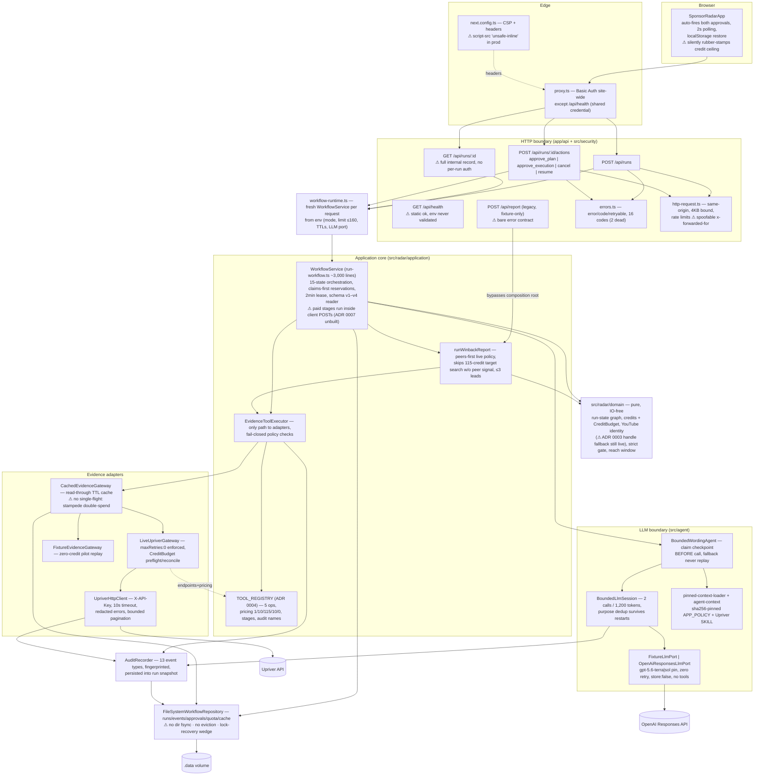
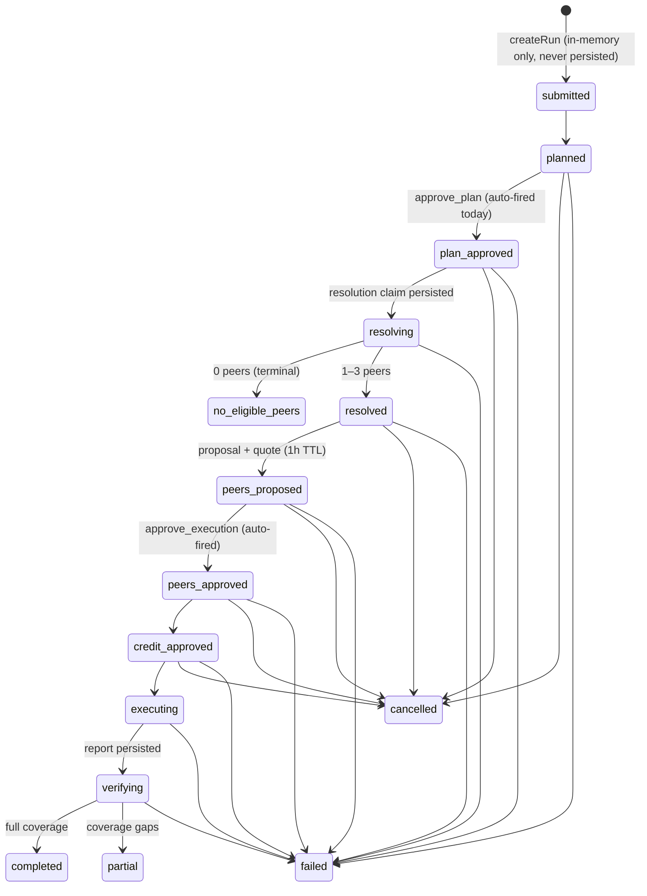

# Sponsor Winback Radar — System Design (current state, 2026-07-21)

This document describes the system **as it is built today** — derived from the working
tree (commit `9308bd7` + ~79 uncommitted changes), not from other docs. It was produced
by an exhaustive multi-agent code audit; every flaw listed was adversarially re-verified
against source. Where the design has a flaw, the flaw is shown in place.

Companion visual: Miro board "Sponsor Radar — System Design (Current State, 2026-07)"
(architecture, run-lifecycle sequence, state machine, flaw register).

---

## 1. What the system is

A single-page Next.js 16 (App Router) product: a user enters one YouTube channel
handle/URL and gets back **0–3 evidence-backed "sponsor winback" leads** — past sponsors
of the target that recently sponsored a reach-comparable peer (0.75–1.25× subscribers,
max 3 peers). Evidence comes from the paid **Upriver API**; an optional bounded
**OpenAI** call rewords already-qualified facts (presentation only). Everything runs in
one Node process with filesystem persistence (`.data/sponsor-radar`), designed for a
single Railway replica with a volume. **Not yet deployed.**

Two modes selected by env: `UPRIVER_MODE=fixture` (default — zero-credit replay of the
frozen @UrAvgConsumer pilot) and `live` (requires `UPRIVER_LIVE_WORKFLOW=true` +
`UPRIVER_API_KEY`).

## 2. Architecture



## 3. Public HTTP contract (today)

| Endpoint | Role | Notes |
|---|---|---|
| `GET /api/health` | Liveness | Only unauthenticated route; static `{status:"ok"}` — does **not** validate env, so a misconfigured deploy stays "healthy" on Railway |
| `POST /api/runs` | Create run | `idempotency-key` header (8–200 chars) → `runId = run_ + sha256("sponsor-radar-workflow\0"+key)[0:32]`; replay-safe; 60 req/5 min |
| `GET /api/runs/:id` | Poll | No rate limit; returns the **full internal record** (audit events, reservations, approvals, quote, state history) — Wave 8 DTO pending |
| `POST /api/runs/:id/actions` | Mutations | Exactly 4 actions: `approve_plan`, `approve_execution`, `cancel`, `resume`; optimistic `expectedVersion` (mismatch → 409 `run_conflict`, retryable); 120 req/5 min |
| `POST /api/report` | Legacy fixture-only report | No UI caller; `{error}`-only contract; returns full audit stream; 503 unless fixture mode |

Errors: `{error, code, retryable}` with a **16-code** union (`malformed_json` and
`capacity_reached` are dead — never emitted). Public status is a projection of 15
internal states into 8 statuses + outcome (`no_eligible_peers` |
`no_qualified_opportunities` | `opportunities_found`) + `availableActions` — but the raw
internal record ships alongside anyway.

## 4. Run lifecycle

```mermaid
sequenceDiagram
    actor U as User
    participant B as Browser (SponsorRadarApp)
    participant A as API routes
    participant W as WorkflowService
    participant T as Evidence tools (executor→cache→gateway)
    participant UP as Upriver API
    participant L as Wording agent (BoundedLlmSession)
    participant O as OpenAI API
    participant R as FS repository (.data)

    U->>B: enter channel, submit (only human action)
    B->>A: POST /api/runs + idempotency-key
    A->>W: createRun — quote 157 (11 res + 146 exec), cap 160
    W->>R: save schema-v4 planned snapshot
    A-->>B: 201 planned (full internal record — known debt)
    B->>A: AUTO approve_plan (useEffect, no user gesture)
    W->>R: record approval, reserve 11 credits CLAIMS-FIRST, persist resolving claim
    W->>T: resolve_target + list_locked_peers
    T->>UP: POST /v1/creators/batch + /similar (zero retry)
    T-->>W: verified identity + ≤3 reach-comparable peers
    W->>L: LLM call 1 — peer rationale (claim checkpoint persisted first)
    L->>O: POST /v1/responses (≤500 tok, 15s)
    W->>R: settle resolution reservation (observed credits)
    A-->>B: peers_proposed + quote (1h TTL)
    B->>A: AUTO approve_execution (echoes quote.creditCeiling; server verifies exact match)
    W->>R: cohort hash re-verified, reserve execution credits, persist executing claim
    W->>T: runWinbackReport — fresh identity re-check, PEERS-FIRST research
    T->>UP: GET /v1/sponsors per peer (90d, cap 2), target only if peer signal (365d, cap 23)
    T-->>W: ≤3 qualified leads + coverage
    W->>L: LLM call 2 — grounded wording (≤700 tok, 20s, deterministic fallback)
    W->>R: settle execution reservation, persist report + audit events
    A-->>B: completed | partial (as approve_execution response)
    B->>A: GET /api/runs/:id every 2s (crash/multi-tab recovery only)
    B-->>U: render report / zero-result / partial banner
```

**Critical architecture fact (ADR 0007 pending):** every paid stage runs synchronously
inside the client-initiated POST handler, and the browser drives progression by silently
auto-approving both human gates. The server never self-advances a run. If the browser
disappears at `planned`/`peers_proposed`, the run stalls forever.

## 5. Run state machine



Terminals: `no_eligible_peers`, `completed`, `partial`, `failed`, `cancelled`.
Cancellable: the 7 pre-paid-claim states only (never `resolving`/`executing`/`verifying`).
Paid stages hold a 2-minute operation lease; interrupted **live** stages are never
replayed — resume settles the full reservation conservatively and fails the run
`ambiguous_live_{stage}` (fixture replays).

## 6. Spend-safety chain (five layers)

1. Env cap `SPONSOR_RADAR_RUN_CREDIT_LIMIT` ≤ `MAXIMUM_RUN_CREDITS=160` (startup-validated).
2. Immutable plan ceilings at createRun. Live cold quote **157** = 1 resolve + 10
   peer-discovery + 115 target sponsors (23×5) + 30 peer sponsors (2×5×3) + 1
   fresh-resolve revalidation.
3. Per-run quota ledger `upriver-run-credits-v1:{runId}` — reservations persisted
   **before** the state transition that references them; settled with audit-observed
   credits; failures settle conservatively (full ceiling in live unless provably
   no-spend). Legacy shared ledger (`upriver-shared-credits`, 200-max) is frozen —
   old runs get `run_restart_required`.
4. `runWinbackReport` preflight (deny before any request). Its 150-credit default is
   reachable only via legacy `/api/report`.
5. `LiveUpriverGateway`'s in-process `CreditBudget` preflight/reconcile per HTTP call +
   `paginateCursor` maxCredits — a **second, parallel accounting system** reconciled
   with the ledger only via audit-derived settlement.

Zero automatic retries on any paid call (`maxRetries:0` enforced by the gateway constructor).

## 7. Persistence

`FileSystemWorkflowRepository` — five hashed-filename collections under the data dir:
`runs/` (revisioned snapshots, optimistic CAS), `events/` (append-only,
contiguity-checked), `approvals/` (idempotency-key hashed, fingerprint replay check),
`quota/` (ledgers), `cache/` (TTL + schema-versioned). Writes are temp-file + fsync +
rename/hardlink, serialized by an in-process queue + cross-process `.workflow.lock` with
dead-PID recovery. Payloads pass a credential-key rejector; keys stored only as SHA-256.
Run snapshots: **writer emits schema v4, reader migrates v1–v4 in memory** (incl. the
historical `phase4`→`wordingAgent` key rename; ADR 0006).

Known gaps (all verified): no parent-directory fsync (power-loss durability of
claims-first writes), no eviction/deletion API anywhere, recovery-sentinel wedge, cache
stampede double-spend, strandable `active` reservations on swallowed settlement failure.

## 8. LLM boundary

Presentation-only, max **2 calls / 1,200 output tokens per run**; per-purpose policies
(peer_rationale 16KB in / 500 tok / 15s; grounded_report_wording 24KB / 700 / 20s). A
durable "claimed" checkpoint is persisted **before** each call; any ambiguity (crash,
provider/model mismatch, validation failure, prior claim) degrades to deterministic
fallback — never a retry, even across restarts (attempted purposes reconstructed from
persisted `llm.started` audit events). Output re-validated against locked
cohorts/ledgers: enum-pinned opaque IDs, no digits/URLs/instruction-text; same-brand
sentences must state the shared domain **and** preserve continuity uncertainty. Prompt
context is hash-pinned (`agent-context/manifest.json`: APP_POLICY.md as system policy,
Upriver SKILL.md sections as untrusted reference; symlink/containment/sha256 verified on
every load). OpenAI adapter: `/v1/responses`, `tools:[]`, `store:false`, strict JSON
schema, zero retries, model pinned `gpt-5.6-terra|sol`.

## 9. Security & tenancy (composite)

- **AuthN:** one shared Basic Auth credential pair for the whole site (prod fail-closed
  503 when unset; **disabled outside production**). No per-user identity.
- **AuthZ:** none per run. `GET /api/runs/:id` has no ownership check, and runIds derive
  deterministically from client-chosen idempotency keys ⇒ any authenticated client can
  read (and act on) any run it can name or re-derive. The single-tenant assumption is
  implicit and stated nowhere.
- CSRF: Origin/Sec-Fetch-Site checked only when the headers are present, and only as a
  side effect of `readBoundedJson`.
- Rate limits: in-process Map keyed by FNV-1a of the first `x-forwarded-for` hop —
  spoofable, collides, resets on restart.
- CSP: `script-src 'self' 'unsafe-inline'` in production (a unit test freezes this);
  the dev-only `unsafe-eval` issue is fixed.
- Secrets: server-only env; persistence rejects credential-like keys; audit fingerprints redact.

## 10. Test estate & gates

~131 unit / ~93 integration / ~74 acceptance cases + 5 eval suites (all offline,
fixture-driven; golden Dell/Dave2D oracle hash-pinned via `tests/fixtures/provenance.json`)
+ 16 Playwright cases + 7 opt-in paid live suites (env-flag gated, hard credit ceilings
2–160, zero retries). `verify` = lint + typecheck + unit(+coverage) + integration +
acceptance + eval + build.

Gaps: Playwright is in no aggregate gate; coverage thresholds (90%) apply only to
`src/radar/domain`; **there is no CI at all** — every gate is manual. The frozen eval
manifest byte-pins the 3 safety case files, but its "gates" block is decorative (never
compared to computed results).

## 11. Environment contract

| Variable | Role |
|---|---|
| `UPRIVER_MODE` | `fixture` (default) \| `live` |
| `UPRIVER_LIVE_WORKFLOW` | must be `true` for live |
| `UPRIVER_API_KEY` | live Upriver key (server-only) |
| `SPONSOR_RADAR_RUN_CREDIT_LIMIT` | default 160, hard-capped at 160 (startup throws above) |
| `SPONSOR_RADAR_DATA_DIR` | default `{cwd}/.data/sponsor-radar` |
| `SPONSOR_RADAR_CACHE_TTL_MS` | default 1h — overrides the cache's own 24h/6h/30d defaults |
| `SPONSOR_RADAR_QUOTE_TTL_MS` | default 1h |
| `SPONSOR_RADAR_LLM_MODE` | `disabled` \| `fixture` (default) \| `openai` |
| `SPONSOR_RADAR_LIVE_LLM` | must be `true` for openai mode |
| `OPENAI_API_KEY`, `SPONSOR_RADAR_OPENAI_MODEL` | openai mode (model pin `gpt-5.6-terra|sol`) |
| `SPONSOR_RADAR_BASIC_AUTH_USER/PASSWORD` | proxy Basic Auth (required in production) |

Test-only: `UPRIVER_LIVE_SMOKE`, `UPRIVER_LIVE_DYNAMIC_SMOKE`*, `UPRIVER_LIVE_SIMILAR_DIAGNOSTIC`*,
`UPRIVER_LIVE_LEGACY_MATRIX`* (+4 params), `SPONSOR_RADAR_LIVE_FULL_WORKFLOW`,
`SPONSOR_RADAR_LIVE_LLM_SMOKE`, `SPONSOR_RADAR_LIVE_LLM_DEEP` (+ Playwright vars).
*The three starred flags are documented nowhere — their scripts no-op silently.*

## 12. ADR scoreboard (docs vs code, verified)

| ADR | Status in code |
|---|---|
| 0001 one-click bounded run | ✅ Implemented (hidden browser approvals are the transitional mechanism) |
| 0002 per-run spend boundary (160/157) | ✅ Implemented; legacy shared ledger frozen |
| 0003 exact channel identity | ⚠️ Partial — `exact_unique_handle` (channelId:null) fallback is still a live path; Wave 2 pending |
| 0004 authoritative tool registry | ✅ Implemented Jul 20 (but the shipped executor omits several target-design commitments) |
| 0005 public product vocabulary | ✅ Largely shipped (4 coverage-notice codes still render raw server text) |
| 0006 persisted-schema compatibility | ✅ Implemented (v1–v4 readers, v4 writer) |
| 0007 server-owned orchestration | ❌ Not implemented — the single biggest architectural gap |

## 13. Verified flaw register

131 flaws were claimed by the audit; the top 45 by severity were adversarially
re-verified (42 confirmed, 3 refuted and dropped; 86 low-severity claims remain
unverified). Severity reflects impact **today** (pre-deployment, fixture-default).

### High

- **H1 — The current core is not in git.** `src/radar/application/tools/`,
  `src/agent/orchestrator/wording-agent.ts`, the 2,979-line acceptance suite,
  replacement evals + frozen case files are untracked while predecessors are staged
  deletions, and **no git remote exists**. One `git clean -fd` deletes the system's core
  irrecoverably. (Coverage itself survived: 26/28 old test names verbatim, 2 renamed.)
- **H2 — ADR 0007 gap.** Browser drives orchestration; all paid work runs inside
  client-initiated POST handlers; runs stall forever if the tab closes at
  `planned`/`peers_proposed`.
- **H3 — Full internal record exposed** on every `/api/runs*` response (audit events,
  reservation IDs, approvals, quote, state history with internal reasons).
- **H4 — Systemic doc-status drift.** ROADMAP lists the implemented registry as open;
  backlog review calls shipped peer-first execution "proposed, awaiting approval",
  Wave 1 "next" though shipped, #19 "open" though implemented+tested; review reconciled
  only to superseded commit `daf9118`. Violates AGENTS.md's own consistency rule.

### Medium — money & persistence

- **M1** Cache stampede: read-through has no single-flight; concurrent misses double-pay Upriver.
- **M2** Atomic writes never fsync the parent dir — claims-first persistence is not power-loss durable.
- **M3** A crash during lock recovery leaves an orphaned `.workflow.lock.recovery` sentinel that permanently wedges persistence (no liveness check, manual delete only).
- **M4** Stage-failure settlement uses `.catch(() => undefined)` — a failed settle strands an `active` reservation forever (failed is terminal; nothing revisits it).
- **M5** `cancelRun` records the approval before the transition — a revision race persists a ghost cancel approval.
- **M6** No eviction/deletion anywhere; live cache keys embed the run date, so keys churn daily and never get reaped.

### Medium — product & API surface

- **M7** Client silently auto-approves both human gates incl. the credit ceiling; audit records `decidedBy:"local-user"` for decisions no human made.
- **M8** Shared Basic Auth + deterministic runIds + no ownership check ⇒ any authenticated client can read/drive any run; key collisions leak run existence.
- **M9** Transient network failures render non-retryable; the only exit ("Back to search") deletes the saved runId while the server may still be spending; one failed poll permanently stops polling.
- **M10** Legacy `/api/report`: bare `{error}`, dispatches by `error.message.includes("YouTube")`, returns the full audit stream.
- **M11** Rate limiting spoofable (leftmost XFF hop), 32-bit hash collisions, process-local.
- **M12** Production CSP allows `unsafe-inline` scripts; no nonce/hash strategy; the unit test freezes the weakness.
- **M13** Resolution-stage audit events omit the wording flag → mixed phases within one run's audit trail.
- **M14** Tool-registry migration plan says "Implemented" but the shipped executor never sees the run record or ledger (plan steps 3/4/7 absent; `auditName`/`cacheable` fields never built).
- **M15** `run-workflow.ts` duplicates the domain terminal-state predicate; the domain's exports have zero production callers.
- **M16** ADR 0003's `exact_unique_handle` fallback still produces handle-only identities on new runs (acknowledged Wave 2 debt).

### Medium — verification infrastructure

- **M17** No CI pipeline exists (no `.github/`); docs and playwright.config assume one.
- **M18** `verify` (the release gate) omits the 16-case Playwright suite.
- **M19** Coverage enforcement covers only `src/radar/domain`, and only via `test:unit`.

### Low (confirmed, abbreviated)

Dead client error-matching (raw-text 409 regexes; three UI-only error codes); dead
server codes (`malformed_json` unreachable, `capacity_reached` never emitted); missing
idempotency-key collapses into a generic 400; CSRF check buried in `readBoundedJson` and
header-optional; `reachRatio` bypassed by two inline reimplementations; deprecated
`parseYouTubeIdentity` still ~25 call sites; similar-diagnostic live test bypasses the
hardened client and prints raw payloads; frozen-eval "gates" decorative, macro-F1 gate
can never bind, report-quality corpus not hash-pinned, `passed` requires a coverage
warning to exist; 3 live-test flags undocumented; `/api/report` success lacks
cache-control; `usage.ts` production-orphaned; stale `test:phase4` alias; 4
coverage-notice codes render raw server text; no focus management across UI view swaps;
hardcoded en-US formatting; docs miscount the error union (16, not 14/15).

---

*Method note: 11 subsystem mappers read every file in full (HTTP boundary, application
core, domain, adapters/persistence, LLM/agent, frontend, tests, evals, docs/ADRs,
ops/config, plus an end-to-end tracer); a completeness critic swept for uncovered files
and cross-subsystem interactions; each of the top 45 flaws was independently re-verified
against source before inclusion. Three claims failed verification and were dropped.*
